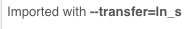
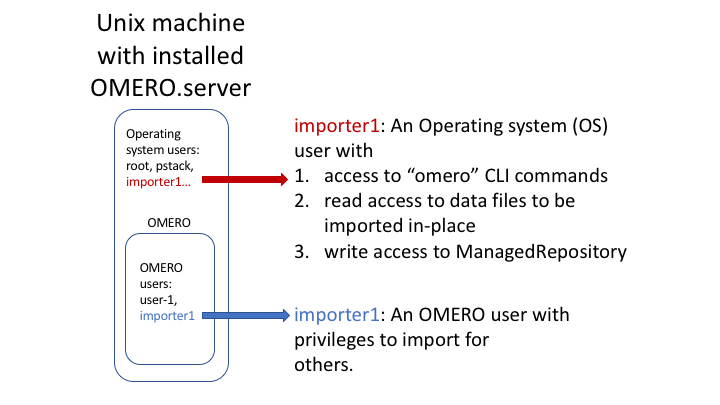

Import data using the Command Line Interface (CLI)
==================================================

Description:
------------

This chapter will show how to import data for another user, using Command Line Interface (CLI).

The user importing the data needs to have some admin (or restricted-admin) privileges. More information about restricted privileges can be found at \ https://docs.openmicroscopy.org/latest/omero/sysadmins/restricted-admins.html

The import for another user will be done only as demo since the user is required to have specific privileges. We will use a user with login name importer1, who could be in real life e.g. a facility manager.

We will show:

-  How to import data using the CLI for myself and for others

-  How to import data using the CLI “in-place”, which means not copying the imported data into OMERO. Instead, OMERO will point to the original location of “in-place” imported files, thus preventing data duplication.

-  How to deal with imports of large amounts of data in CLI, using the --bulk option and helper csv and yml files which define what is to be imported and how.

**Resources:**
--------------

-  Documentation:

   -  https://docs.openmicroscopy.org/latest/omero/users/cli/installation.html

   -  `https://docs.openmicroscopy.org/omero/latest/users/cli/index.html <https://docs.openmicroscopy.org/omero/latest/users/cli/index.html>`__

   -  `https://docs.openmicroscopy.org/omero/latest/users/cli/import-target.html <https://docs.openmicroscopy.org/omero/latest/users/cli/import-target.html>`__

   -  `https://docs.openmicroscopy.org/omero/latest/sysadmins/in-place-import.html <https://docs.openmicroscopy.org/omero/latest/sysadmins/in-place-import.html>`__

   -  `https://docs.openmicroscopy.org/omero/latest/users/cli/import-bulk.html <https://docs.openmicroscopy.org/omero/latest/users/cli/import-bulk.html>`__

-  Data: example images from

   -  https://downloads.openmicroscopy.org/images/DV/will/FRAP/

-  Bash script for performing in-place imports:

   -  https://github.com/ome/training-scripts/blob/master/maintenance/scripts/in_place_import_as.sh

-  Example files for bulk import

   -  :download:`bulk.yml <../scripts/bulk.yml>`

Setup:
------

**CLI Importer installation**

Client libraries from the OMERO.server have to be installed on the client to import images using CLI. The installation instructions can be
found at \ https://docs.openmicroscopy.org/latest/omero/users/cli/installation.html\ .

Note: When importing for another user using the CLI, the importer1 does not have to be a member of the target group.

**Step-by-step:**
-----------------

#.  Open a terminal and connect to the server as importer1 using ``ssh``.

#.  The aim is to import an image from /OMERO/in-place-import/FRAP::
    
    $ ls /OMERO/in-place-import/FRAP

#.  Activate the virtual environment where ``omero-py`` is installed or add it to ``PATH`` e.g.::

    
    $ export PATH=/opt/omero/server/venv3/bin:$PATH

#.  Point ``OMERODIR`` to the location where the OMERO server is installed e.g.::

    $ export OMERODIR=/opt/omero/server/OMERO.server

#.  The importer1 user logs in as themselves::

    $ omero -u importer1 login

#.  Creates a Dataset import_for_myself::

    $ DID=$(omero obj new Dataset name=import_for_myself)

#.  Import the data in the newly created Dataset::

    $ omero import -d $DID /OMERO/in-place-import/FRAP/U20S-RCC1.10_R3D_FRAP.dv

#.  The importer1 user logs in as user-1::

    $ omero --sudo importer1 -u user-1 login

#.  Create a Dataset import_for_user_one as user-1::

    $ DID=$(omero obj new Dataset name=import_for_user_one)

#.  Import the data in the newly created Dataset::

    $ omero import -d $DID /OMERO/in-place-import/FRAP/U20S-RCC1.10_R3D_FRAP.dv

#. Check that the images are successfully imported.

In-place Import using the CLI 
=============================

Instead of being copied into OMERO’s managed repository, the image files
stay at their original place and are just linked into the repository.

It is only available for the CLI importer, using the argument ``--transfer=ln_s``.

   .. image:: images/importcli1.png

**Advantages:**

-  All in-place import scenarios provide non-copying benefit. Data that is too large toxist in multiple places, or which is accessed too frequently in its original form to be renamed,remains where it was originally acquired.

**Limitations:**

-  Only available on the OMERO server system itself.

-  Do not edit or move the files after an in-place import. OMERO may no longer be able to access them if you do.

**Important:**

Someone wanting to perform an in-place import MUST have:

-  a regular OMERO account

-  an OS-account with access to bin/omero

-  read access to the location of the data

-  write access to the ManagedRepository or one of its subdirectories. More information about the ManagedRepository can be found at \ https://docs.openmicroscopy.org/latest/omero/developers/Server/FS.html

   .. image:: images/importcli2.png

**Step-by-step:**
-----------------

- Make sure that the virtual environment where ``omero-py`` is installed is activated and ``OMERODIR`` is defined, as above

-  Log in again::

    $ omero --sudo importer1 -u user-1 login

-  ‘In place’ import a large SVS file into the same dataset as above::

    $ omero import -d $DID --transfer=ln_s /OMERO/in-place-import/svs/77917.svs

-  Check that the image is successfully imported.

-  Click on the paths icon |image3| to show the difference between the normal and in-place (ln_s) imported images. Validate that In-place import is indicated \ |image4|\ .

-  Note: The script `in_place_import_as.sh <https://github.com/ome/training-scripts/blob/master/maintenance/scripts/in_place_import_as.sh>`_  shows how to perform the in-place import steps described above in one single command.

Bulk Import using the CLI
=========================

In this example, we show how to combine several import strategies using a configuration file. This is a strategy heavily used to import data to \ https://idr.openmicroscopy.org/\ .

We import two folders named *siRNA-HeLa* and *condensation*. For this training, the path to the OMERO.server is /opt/omero/server.

#. Open a terminal and connect to the server as importer1 over ``SSH``.

#. Note: Connecting over SSH is necessary only if you intend to import in-place. If a classic import is being performed, you can connect to the server remotely using OMERO.cli and still use the bulk import as described below.

#. Description of the files used to set up the import, the files are in the directory ``/OMERO/in-place-import``. See :download:`bulk.yml <../scripts/bulk.yml>`, :download:`import-paths.csv <../scripts/import-paths.csv>` and `import-bulk.html#bulk-imports <https://docs.openmicroscopy.org/latest/omero/users/cli/import-bulk.html#bulk-imports>`_ for further details.

   - ``import-paths.csv``: (.csv, comma-separated values) this file has at least two columns. In this case the columns are separated by commas. The first column is the name of the target Dataset and the second one is the path to the folder to import. We will import two folders (the ``import-paths.csv`` has two rows).

      Example csv (note the comma between the "HeLa" and "/OMERO..."):

      ``*Dataset:name:Experiment1-HeLa,/OMERO/in-place-import/siRNAi-HeLa*``
      
      ``*Dataset:name:Experiment2-condensation,/OMERO/in-place-import/condensation*``

   
   - ``bulk.yml``: this file defines the various import options: transfer option, checksum algorithm, format of the .csv file, etc. Note that setting the dry_run option to true allows to first run an import in dry_run mode and copy the output to an external file. This is useful when running an import in parallel.
   
      Example bulk.yml:

    .. code-block:: python

        *continue: "true"*

        *transfer: "ln_s"*

        *# exclude: "clientpath"*

        *checksum_algorithm: "File-Size-64"*

        *logprefix: "logs"*

        *output: "yaml"*

        *path: "import-paths.csv"*

        *columns:*

            -  *target*

            -  *path*

#. Find the place where the data are stored outwith OMERO, for example /OMERO/in-place-import i.e. ``cd /OMERO/in-place-import``

#. The importer1 (Facility Manager with ability to import for others) user logs in as user-1::

   $ omero --sudo importer1 -u user-1 login

#. Import the data using the ``--bulk`` command::

   $ omero import --bulk bulk.yml

#. Go to the webclient during the import process to show the newly created dataset. The new datasets in OMERO are named Experiment1-HeLa and Experiment2-condensation. This was specified in the first column of the ``import-paths.csv`` file.

#. Select an image.

#. In the right-hand panel, select the General tab to validate:

   - Click on |image3| to show the import details.

   - Validate that In-place import is indicated \ |image4|\ .

**Advantages:**

-  Large amount of data imported using one import command.

-  Reproducible import.

**Limitations:**

-  Preparation of the .csv or .tsv file.

For more information about CLI import options, go to `import.html <https://docs.openmicroscopy.org/latest/omero/users/cli/import.html>`_.

.. |image3| image:: images/importcli3.png
   :width: 0.30208in
   :height: 0.21875in

