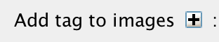
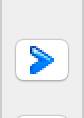

**Import data using the Desktop Client**
========================================

Description:
------------

In the first part, we first show how to import data by yourself and for yourself into OMERO using various import strategies. This will be mainly done using the OMERO.insight desktop client.

Second part of this import section will show how to import data for
another user, using OMERO.insight. The user importing the data needs to have some admin or restricted-admin privileges. More information about restricted privileges can be found at \ https://docs.openmicroscopy.org/latest/omero/sysadmins/restricted-admins.html

The import for another user requires that the user doing the import has specific privileges. We will use the user importer1, this could be, for example, a facility manager\ .

We will show:

-  How to install the OMERO.insight desktop client on Windows, Mac and Linux.

-  How to import data for the user logged in using OMERO.insight.

-  How to select a target Project and Dataset or create a new ones in OMERO for the imports.

-  How to add Tags to imported images at the import stage, to facilitate the management of these images later in OMERO.server.

-  How to import data for other users in OMERO.insight.

Setup:
------

OMERO.insight desktop client installation instructions:.

Download the OMERO.insight client corresponding to your operating system at:
`https://www.openmicroscopy.org/omero/downloads <https://www.openmicroscopy.org/omero/downloads/>`__\ 

   .. image:: images/importinsight1.png

**Windows**

-  From version 5.5.0, OMERO.insight comes with two installers: ``.msi`` and ``.exe``.

-  Click onto the downloaded ``.exe`` or ``.msi`` file.

-  This will run the installer. The ``.exe`` file installs by default in the userspace apps folder. This can be changed during the installation process.

   .. image:: images/importinsight2.png

   .. image:: images/importinsight3.png

-  The ``.msi`` installer will deploy the application in the ``Program Files`` folder of Windows. *OMERO.insight* is then available to all the users of the target machine. *OMERO.insight* installed in the userspace is only available to the user who did the installation. A Desktop icon and a new *OMERO.insight* Start menu item will be created.

**Mac**

-  From version 5.5.0, OMERO.insight can be installed using an Apple DMG (``.dmg``) file.

-  Mac OS X: Click onto the downloaded ``.dmg`` installer to start the installation.

   .. image:: images/importinsight4.png

-  This will mount the DMG it to your Mac. The DMG mounts in two places: on your Desktop and in the Finder sidebar under your hard drive.

   .. image:: images/importinsight5.png

-  Clicking either one of these opens the DMG file. When you open a DMG file, you will usually see two things:

   -  the app itself.

   -  a link to your applications folder.

-  Depending on your settings, the Applications folder icon might not appear. In such case, drop the app icon into the Applications folder.

   .. image:: images/importinsight6.png

Linux

-  Unzip the downloaded ``.zip`` file.

   .. image:: images/importinsight7.png

-  Click on the omero-insight file to start the application.

   .. image:: images/importinsight8.png

Step-by-step:
-------------

#. Open OMERO.insight and in the login dialog, click on the wrench icon \ |image8a|

#. This will open a list of servers to which you can connect. By default, only "localhost" is listed. Click on the plus icon to add a new line to the list and type into the line the server address.

   .. image:: images/importinsight9.png
   .. note::
      If your server is running on a default port (``4064``), as it is usually the case, then you can simply just type in the server name such as ``my.server.name``. For servers running on a non-default port, e.g. ``54064``, type the address of the server as ``my.server.name:54064`` into the above dialog. Alternatively, you can also type in the IP address of your server, or connect using websocket.
#.  When done, click *Apply*.

#.  Log in using the username and password provided.

#.  In OMERO.insight, click on the Importer Icon |image10|\ in the toolbar.

#.  Browse your local hierarchy in the left-hand pane of the importer, select single images or whole folders and add these to the Queue by clicking on the arrow \ |image11|\ icon.

#.  In the Import Location window, select the target Project and Dataset (existing or create a new one) to import to.

#.  Note: If no Dataset is selected or created, a new Dataset will be automatically created and named after the folder containing the images to be imported.

#.  Optional: Go to the *Options* tab

    - Click on |image12| to bring the Tag selection dialog.

    - Select the tag(s) on the left-hand side or create a new one.

    - Click |image13| to move the tag(s) to the right-hand side.

    - Click Save.

#. Click on the Import button in the bottom-right corner of the Importer window. You should see two progress bars for every image imported, Upload and Processing.

#. Note: The import of the next image in the queue starts immediately after the Upload of the previous one is finished. The Processing phase of the import is done on the OMERO.server only, and can be finished while the next image(s) is/are being uploaded to the server.

#. Once imports are finished, go back to the OMERO.insight main window and click the Refresh button |image14| above the right-hand pane. This will display the imported images inside the Dataset and/or Project you specified previously in the Import Location window.

#. (demo only step) Now, the demonstrator will log out from OMERO.insight and log in again, this time as some other user and will show the import process again, this time importing a different set of images. After this import, the two sets of images (belonging to two different users) will be shown in the webclient.

**Import for another user**
===========================

In this example, we show how to import data for another user. A facility manager importer1 with restricted admin privileges imports the data for user-1. The facility manager has been given the ability to import for others.

The steps are the same as before for the normal import, but as importer1 has the permission to import for another user there are two drop down menus for selecting the user and group to import for:

   .. image:: images/importinsight15.png

-  Select Group: ‘Lab1’

-  Select User: ‘Francis Crick’

-  Continue the import workflow as usual.

A restriction of OMERO.insight is that the user importer1 needs to be a member of the groups he wants to import for. This restriction does not hold when importing the the Command Line Interface (CLI) (link to CLI import g.doc).

