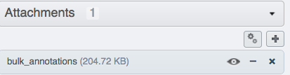
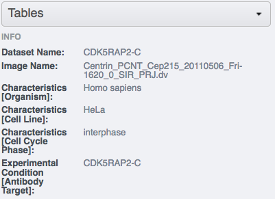
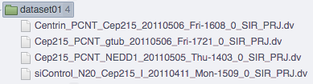
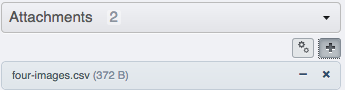
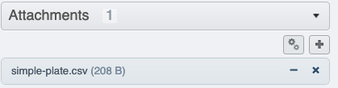
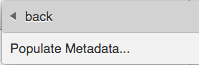
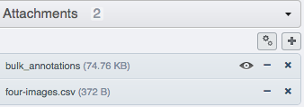
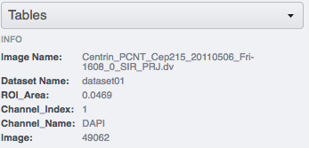

Import metadata using the Populate Metadata script in OMERO.web
===============================================================

Description
-----------

This chapter will show how to import metadata starting from a local CSV file and ending with OMERO.tables on Images or wells using the `server-side script <https://omero-guides.readthedocs.io/en/latest/scripts/docs/index.html>`__ Populate Metadata in OMERO.web. See also the workflow described in :doc:`metadata` which will give you more possibilities, such as Key-Value Pairs creation, but which is using Command Line Interface (CLI). The workflow described here is using only graphical user interface elements.

This action is typically done after a successful import of Images.

We will show:

- How to import metadata from local CSV file in a bulk manner and turn them into OMERO.tables on

   - :ref:`Images contained in Projects/Datasets<Populatemetadatapdi>`
   - :ref:`Wells contained in Screens/Plates<Populatemetadataspw>`

- How to :ref:`create or adjust a local CSV file containing metadata<Populatemetadatacsv>` for creation of OMERO.tables containing numbers and text. 

Resources
---------

-  Annotation CSV files define the content of OMERO.tables for each image or each well.

   - :download:`four-images.csv <../scripts/four-images.csv>`
   - :download:`simple-screen.csv <../scripts/simple-screen.csv>`

-  ``omero-metadata`` plugin (necessary for having full set of features in ``Populate Metadata`` script).

   - https://pypi.org/project/omero-metadata/

Setup
-----

**omero-metadata plugin installation**

.. note::
      For the best experience, the ``omero-metadata`` plugin should be installed on your OMERO.server. The ``Populate Metadata`` script tries to reuse the code of the ``omero-metadata`` plugin. If the plugin is not found on the server, the ``Populate Metadata`` script falls back on a deprecated code, with limited set of features. The ``omero-metadata`` plugin installation is typically done by the administrator of the OMERO.server.

- In your OMERO.server environment, go to the environment where you installed your OMERO.cli as specified under - `CLI installation <https://docs.openmicroscopy.org/omero/latest/users/cli/installation.html>`_.

- Activate the virtual environment.

- Run::
    
    $ pip install omero-metadata

**Populate Metadata script**

No explicit installation necessary, shipped with the OMERO.server.

Step-by-step
------------

.. _Populatemetadatapdi:

*Project/Dataset/Image*
~~~~~~~~~~~~~~~~~~~~~~~

#.  Log in to OMERO.web, create a new Dataset and copy into it four Images, preferably Images which have no OMERO.tables on them. Note the name of the Images you are copying in.

    |image4|

#.  Download :download:`four-images.csv <../scripts/four-images.csv>`. Open the CSV file in Excel and edit the name of the Images in the first column to match the names of the Images you copied into your Dataset in the previous step. Also, edit the name of the Dataset in the second column to match the name of your Dataset in OMERO.web. Save the file locally as CSV.

#.  (Optional) In your OMERO.web, upload the CSV file you just saved and attach it onto the Dataset you created previously. Alternatively, you can skip this step, and point the ``Populate Metadata`` script to the local CSV, as explained below.

    |image5|

#.  Select the Dataset you created. Find the script icon |image6| above the central pane, expand it and find the ``Import scripts`` section. In there, select the ``Populate metadata`` script which will launch the script dialog.

    |image7|

#.  If you did not attach the CSV to the Dataset, you can now click on the ``Browse`` button and select the CSV from your local machine.

#.  Click ``OK`` to run the script, and wait for it to show as complete in the ``Activities`` panel in the top-right corner above the central pane.

#.  Click again onto the Dataset in the left-hand pane to refresh and observe that there is a new Attachment in the right hand pane under "Attachments" harmonica, named ``bulk_annotations``. 

    |image8|

#.  Click on single Images inside the Dataset and observe that in the "Tables" harmonica in the right-hand pane there are new values coming originally from your edited CSV.

    |image9|

.. _Populatemetadataspw:

*Screen/Plate/Well*
~~~~~~~~~~~~~~~~~~~

#.  Find a Plate inside a Screen in OMERO.web which has no OMERO.tables on its Wells.

#.  Download :download:`simple-screen.csv <../scripts/simple-screen.csv>`. Open the CSV file in Excel and edit the name of the wells in the first column to match the names of the wells in your Plate from the previous step. Also, edit the name of the Plate in the second column to match the name of your Plate in OMERO.web. Save the file locally as CSV.

#.  (Optional) In your OMERO.web, upload the CSV file you just saved and attach it onto the Screen containing the Plate you created previously. Alternatively, you can skip this step, and point the ``Populate Metadata`` script to the local CSV, as explained below.

    |image5b|

#.  Select the Screen you identified above. Find the script icon |image6| above the central pane, expand it and find the ``Import scripts`` section. In there, select the ``Populate metadata`` script which will launch the script dialog.

    |image7|

#.  If you did not attach the CSV to the Screen, you can now click on the ``Browse`` button and select the CSV from your local machine.

#.  Click ``OK`` to run the script, and wait for it to show as complete in the ``Activities`` panel in the top-right corner above the central pane.

#.  Click again onto the Screen in the left-hand pane to refresh and observe that there is a new Attachment in the right hand pane under ``Attachments`` harmonica, named ``bulk_annotations``.

#.  Click on single Wells inside the Plate under the Screen and observe that in the ``Tables`` harmonica in the right-hand pane there are new values coming originally from your edited CSV.  

.. _Populatemetadatacsv:

*Create a metadata CSV*
~~~~~~~~~~~~~~~~~~~~~~~

#.  Download the :download:`four-images.csv <../scripts/four-images.csv>` (for Images in Projects/Datasets) or :download:`simple-screen.csv <../scripts/simple-screen.csv>` (for Wells in Screens/Plates) as templates to create your own CSV.

#.  Open the downloaded CSV file in Microsoft Excel, but do not use ``Import`` command in Excel, instead, either double-click on the file or use the ``Open`` command in Excel. Populate the values in the CSV using Microsoft Excel with your own numbers or text, possibly expanding the number of rows or columns as appropriate.

#.  Replace the ``# header ...`` column types inside the templates with your own column types according to the content of your CSV: Follow the Note below for guidelines. Save the file as CSV in Microsoft Excel.

.. note::
      The ``# header`` row is optional. If ``# header`` is not used, all column types are treated as String (i.e. text, not numbers) in OMERO. 
      The header abbreviations have following meaning:
      
      **d**: DoubleColumn, for floating point numbers
      
      **l**: LongColumn, for integer numbers
      
      **s**: StringColumn, for text
      
      **b**: BoolColumn, for true/false
      
      **plate, well, image, dataset, roi**: to specify objects

      If the target is a Project, the CSV file needs to specify Dataset Name and Image Name.
      If the target is a Dataset instead of a Project, the Dataset Name column is not needed. 

      If the target is a Screen, the CSV file needs to specify Plate name and Well. If a ``# header`` is specified, column types must be ``well`` and ``plate``. If the target is a Plate, the CSV file **must not** specify a Plate column, but it must specify the Well column.

      Column names should not contain spaces if you want to be able to query by these columns.

.. |image3a| image:: images/metadata3a.png
   :width: 4in
   :height: 3.3in

